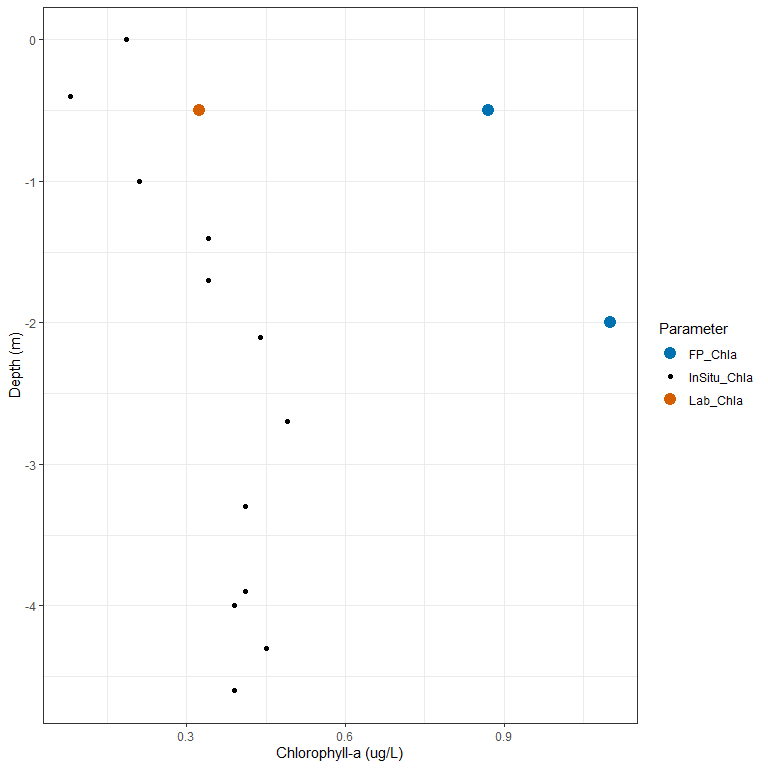
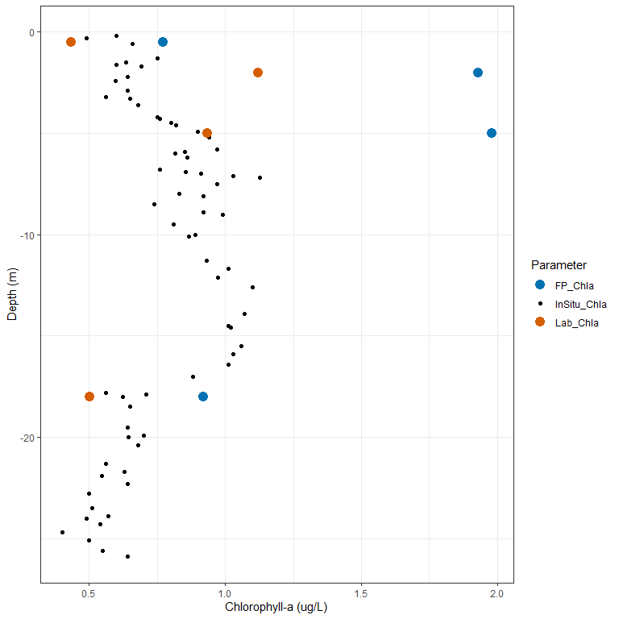
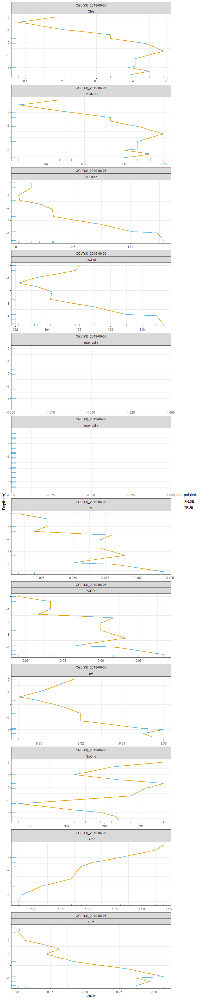
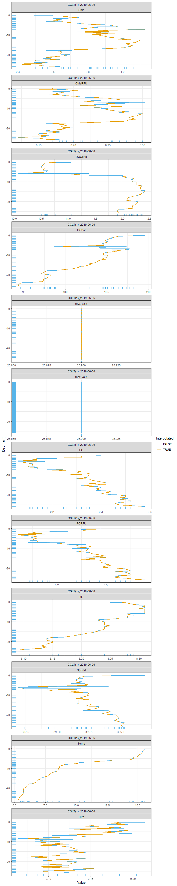
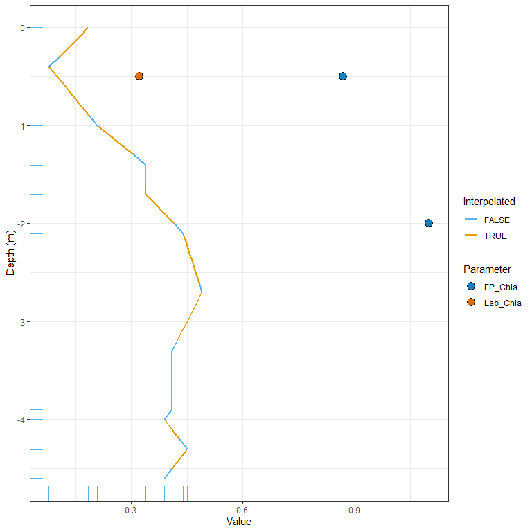
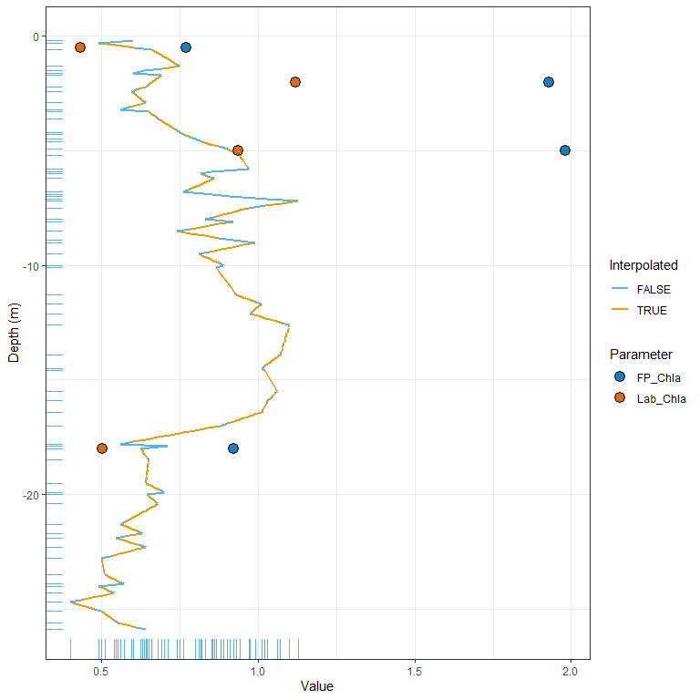

# Goals

1.  Join the profile data to the discrete data based on nearest depth.
2.  Interpolate results to estimate a measurement at every 0.1 meter
    depth.

# Setup

Load the necessary R packages into the environment.

``` r
library(tidyverse)
library(here)
```

Establish dynamic file path to the R project folder.

``` r
root_dir <- here::here()
```

# Load Data

Load in data stored as a CSV file.

``` r
# Load profile data
profile_df <- read.csv(file = file.path(root_dir,
                                        "data",
                                        "2019_CG_EXO2_Final.csv"),
                       stringsAsFactors = FALSE)
# Load discrete data
discrete_df <- read.csv(file = file.path(root_dir,
                                         "data",
                                        "2019_CG_lab.csv"),
                       stringsAsFactors = FALSE,
                       skip = 1)
```

# Data Wrangling

Below are various steps for standardizing discrete and profile data
sets.

## Discrete Data

``` r
# Keep only the rows that represent true water samples (WS). Remove QA samples.
discrete_df <- discrete_df[discrete_df$Type %in% "WS", ]
# Convert the date to a date type.
discrete_df$Date <- as.Date(discrete_df$Date, "%m/%d/%y")
# Create a unique sampling event ID
discrete_df$Event_id <- paste(discrete_df$Site,
                              discrete_df$Date,
                              sep = "_")
# Ensure that depth is numeric
discrete_df$Depth <- as.numeric(discrete_df$Depth)
# Remove unnecessary columns
discrete_df <- discrete_df[!names(discrete_df) %in% c("ID",
                                                      "Position",
                                                      "Type")]
# Remove periods from column names.
discrete_df <- discrete_df %>% 
  rename(FP_Chla = "FPChl.a",
         Lab_Chla = "Lab.Chl.a")
```

## Profile Data

``` r
# Convert the date to a date type.
profile_df$Date <- as.Date(profile_df$Date, "%m/%d/%y")
# Create a unique sampling event ID
profile_df$Event_id <- paste(profile_df$Site,
                             profile_df$Date,
                             sep = "_")
# Use "Depth" as the standard name.
profile_df$Depth <- profile_df$Depth_tenth_m
# Remove unnecessary columns.
profile_df <- profile_df[!names(profile_df) %in% c("Time",
                                                  "Depth_tenth_m",
                                                  "Depth_m")]
```

# Functions

Standardized methods for wrangling data and creating plots.

## Data Wrangling Functions

### Depth Complete

``` r
#' Complete the Depth Profile
#'
#' @param .x a data frame.
#' @param .depth the name of the depth column unquoted.
#' @param ... column names unquoted that will be used to 
#' aggregate (group) the data.
#'
#' @return a data frame.
#' @export

depth_complete <- function(.x, .depth, ...) {
  .x %>% 
  dplyr::group_by(...) %>% 
  tidyr::complete({{.depth}} := seq(from = 0,
                              to = max({{.depth}},
                                       na.rm = TRUE),
                              by = 0.1)) %>% 
    dplyr::ungroup()
}
```

### Interplolate

``` r
#' Linear Interpolate
#'
#' @param .x a vector of numeric values that will provide the increment of interpolation.
#' @param .y a vector of numeric values to be interpolated.
#' @param .quite a logical value indicating if a warning should be printed (FALSE) or not 
#' (TRUE).
#' @return a numeric vector.

interpolate <- function(.x, .y, .event, .quite = FALSE) {
  x_length <- length(.x[!is.na(.x)])
  y_length <- length(.y[!is.na(.y)])
  
  if (x_length >= 2 & y_length >= 2) {
    approx(x = .x,
           y = .y,
           xout = .x,
           method = "linear",
           rule = 2)$y
  } else {
    if (!.quite) warning(
      # When using dplyr::across() to call this function, this message is less
      # informative. It will print ".x" instead of the column name representing .y.
      paste0(
        unique(.event),
        "(",
        deparse(substitute(.y)),
        ") \n",
        "\t One of the supplied values had less than 2 values. \n",
        "\t .x (",
        deparse(substitute(.x)),
        ") length = ",
        x_length,
        "\n",
        "\t .y (",
        deparse(substitute(.y)),
        ") length = ",
        y_length,
        "\n",
        "\t The original .y values will be returned. \n"
      ))
    .y
  }
}
```

### chla\_prep

``` r
#' Wrangle the Chlorophyll-a Data
#'
#' @param .x a data frame.
#' @param .event a string representing an event ID.
#'
#' @return a data frame.

chla_prep <- function(.x, .event) {
  cdepth_sub <- .x %>% 
  filter(Event_id %in% .event,
         Parameter %in% "Chla") %>% 
  dplyr::select(-Parameter) %>% 
  tidyr::pivot_longer(
    cols = c("Value", 
             "Lab_Chla",
             "FP_Chla"),
    names_to = "Parameter",
    values_to = "Value"
  ) %>% 
  mutate(Parameter = if_else(Parameter %in% "Value",
                             "InSitu_Chla",
                             Parameter))
}
```

## Plotting Functions

### Chla\_plot

``` r
#' Chlorophyll-a Plots
#'
#' @param .x a data frame.
#' @param .event a string representing an event ID.
#'
#' @return a plot.

chla_plot <- function(.x, .event) {
  chla_df <- chla_prep(.x = .x,
                       .event = .event)
  
  chla_df %>% 
    ggplot(aes(x = -Depth,
               y = Value)) +
    geom_point(aes(color = Parameter, 
                   size = Parameter)) +
    scale_color_manual(values = c("InSitu_Chla" = "black",
                                  "FP_Chla" = "#0072B2",
                                  "Lab_Chla" = "#D55E00")) +
    scale_size_manual(values = c("InSitu_Chla" = 1.5,
                                 "FP_Chla" = 4,
                                 "Lab_Chla" = 4)) +
    coord_flip() +
    theme_bw() +
    ylab("Chlorophyll-a (ug/L)") +
    xlab("Depth (m)")
}
```

### geom\_profile

``` r
#' Standardized Method for Plotting Profile Data
#'
#' @param .x a data frame
#'
#' @return a ggplot object.

geom_profile <- function(.x) {
  # When not specifying ggplot2::ggplot(), you must create a list of layers
  list(
    # Add a line representing profile data
    # Color indicates when the value is interpolated
    geom_line(data = .x, aes(color = Interpolated,
                  group = Parameter),
              size = 1),
    # This provides tick marks on the axes to indicate where
    # observed values fall (not-interpolated values).
    # This is especially helpful when the observed values are low.
    geom_rug(data = dplyr::filter(.x,
                           Interpolated == FALSE,
                           !is.na(Value)),
             aes(color = Interpolated,
                 group = Parameter)),
    # Colors to be used on line and rug
    scale_color_manual(values = c("TRUE" = "#E69F00", 
                                  "FALSE" = "#56B4E9")),
    # Nice theme
    theme_bw(),
    # Depth had to be specified as the x-value to get the plot to arrange
    # itself correctly. coord_flip() puts depth on the y-axis.
    coord_flip(),
    # x-axis label
    xlab("Depth (m)")
  )
  
}
```

### chla\_points

``` r
#' Standardized Method for Plotting Chlorophyll-a Points
#'
#' @param .x a data frame
#'
#' @return a ggplot object.

chla_points <- function(.x) {
  # When not specifying ggplot2::ggplot(), you must create a list of layers
  list(
    # Scatter plot points
    ggplot2::geom_point(data = .x,
             ggplot2::aes(fill = Parameter),
             shape = 21,
             size = 4,
             alpha = 0.9),
    # Color the scatter plot points
    ggplot2::scale_fill_manual(values = c("FP_Chla" = "#0072B2",
                                          "Lab_Chla" = "#D55E00"))
  )
  
}
```

### profile\_plot

``` r
#' A Facet Wrapped Plot of Parameter Depth Profile
#'
#' @param .x a data frame.
#' @param .event a string representing an event ID.
#'
#' @return a facet wrapped plot.

profile_plot <- function(.x, .event) {
  # Keep only rows with the specified Event_id (.event)
 event_df <- .x %>%
    dplyr::filter(Event_id %in% .event)
 
 # Initiate plot
 ggplot2::ggplot(data = event_df, 
                 ggplot2::aes(y = Value,
                              x = -Depth)) + 
   # Add standardized profile layers
   geom_profile(.x = event_df) +
   # Create individual plots for each parameter
   ggplot2::facet_wrap(~Event_id + Parameter,
              ncol = 1,
              scales = "free")
}
```

### chla\_interp\_plot

``` r
#' Chlorophyll-a Plots
#'
#' @param .x  a data frame.
#' @param .event a single quoted event ID.
#'
#' @return a plot.

# .x <- interp_df
# .event <- "CGLT(1)_2019-09-05"
chla_interp_plot <- function(.x, .event) {
  # Wrangle the chla DF
  chla_df <- chla_prep(.x = .x,
                      .event = .event)
  
  # Initiate plot
  ggplot2::ggplot(data = chla_df, 
                  ggplot2::aes(y = Value,
                               x = -Depth)) + 
    # Apply the generic geom_profile layers
  geom_profile(.x = chla_df %>% dplyr::filter(Parameter %in% "InSitu_Chla")) +
    # Apply the generic chla_points
  chla_points(.x = chla_df %>% dplyr::filter(!Parameter %in% "InSitu_Chla"))
}
```

# Complete the Depth Profile

``` r
# Apply depth_complete to the profile_df 
cdepth_df <- depth_complete(.x = profile_df,
                            .depth = Depth,
                            Event_id,
                            Lake,
                            Site,
                            Date) %>% 
  # Transform the data from a wide- to long-format
  tidyr::pivot_longer(
    # Pivot by all columns except the ones listed in !all_of()
    cols = !all_of(c("Event_id",
                     "Lake",
                     "Site",
                     "Date",
                     "Depth")),
    # Column names will be placed in the "Parameter" column
    names_to = "Parameter",
    # Values from each column, corresponding with the "Parameter" column,
    # will be placed in the "Value" column
    values_to = "Value"
  ) %>% 
  # Join the discrete data to the complete depth profile.
  left_join(y = discrete_df,
            by = c("Event_id",
                     "Lake",
                     "Site",
                     "Date",
                     "Depth"))
```

## Example Plots

### Event ID: CGLT(3)\_2019-06-06

``` r
chla_plot(.x = cdepth_df,
             .event = "CGLT(3)_2019-06-06")
```

    ## Warning: Removed 138 rows containing missing values (geom_point).

<!-- -->

### Event ID: CGLT(1)\_2019-06-06

``` r
chla_plot(.x = cdepth_df,
             .event = "CGLT(1)_2019-06-06")
```

    ## Warning: Removed 772 rows containing missing values (geom_point).

<!-- -->

# Interpolation

1.  The rows to the complete depth profile data frame (`cdepth_df`) are
    aggregated (grouped) by `Event_id` and `Parameter`.
2.  The rows are then ordered by the `Event_id`, `Parameter`, and
    `Depth` values per group.
3.  The linear interpolation (see custom `interpolate()` function in the
    [Functions](#functions) Section)
4.  Ungroup the data to remove the data aggregation applied in step 1.
5.  Remove the current `Value` column and replace the `interp_value`
    column name with `Value`.

``` r
interp_df <- cdepth_df %>% 
  # Aggregate the data by Event_id and Parameter
  dplyr::group_by(Event_id, Parameter) %>%
  # Order the data based on Depth
  dplyr::arrange(Event_id, Parameter, Depth) %>%
  # Apply linear interpolation
  dplyr::mutate(interp_value = interpolate(.x = Depth,
                                           .y = Value,
                                           .event = Event_id,
                                           .quite = TRUE),
                # Identify when the value is interpolated (TRUE) or not (FALSE)
                Interpolated = is.na(Value) & !is.na(interp_value)) %>% 
  # Remove the aggregation created by group_by()
  dplyr::ungroup() %>% 
  # Drop the Value column
  # No longer necessary the Interpolated (logical) column indicates which 
  # values are interpolated and which are not.
  dplyr::select(-Value) %>% 
  # Rename the interp_value column to Value
  dplyr::rename(Value = interp_value)
```

## Example Plots

The plots below provide a complete look at the depth profile by applying
a linear-interpolation to the observed profile data.

The tick marks on the axes indicate when an observed value is present in
the depth profile. Although the line is colored to indicate when the
value is observed (`Interpolated == FALSE`) and when the value is
interpolated (`Interpolated == TRUE`), it can be difficult to see short
strands of the line representing observed data–effectively making it
appear as if there is no observed data present. The tick marks make it a
little easier to identify when and where observed data is present.

### Event ID: CGLT(3)\_2019-06-06

``` r
profile_plot(.x = interp_df,
             .event = "CGLT(3)_2019-06-06")
```

<!-- -->

### Event ID: CGLT(1)\_2019-06-06

``` r
profile_plot(.x = interp_df,
             .event = "CGLT(1)_2019-06-06")
```

<!-- -->

# Hybrid Plots

These plots are a hybrid between the `profile_plots()` and the
`chla_plots()` showing the interpolated depth profile and a scatter-plot
of lab discrete points.

The tick marks on the axes indicate when an observed value is present in
the depth profile. Although the line is colored to indicate when the
value is observed (`Interpolated == FALSE`) and when the value is
interpolated (`Interpolated == TRUE`), it can be difficult to see short
strands of the line representing observed data–effectively making it
appear as if there is no observed data present. The tick marks make it a
little easier to identify when and where observed data is present.

## Example Plots

### Event ID: CGLT(3)\_2019-06-06

``` r
chla_interp_plot(.x = interp_df,
                 .event = "CGLT(3)_2019-06-06")
```

    ## Warning: Removed 99 rows containing missing values (geom_point).

<!-- -->

### Event ID: CGLT(1)\_2019-06-06

``` r
chla_interp_plot(.x = interp_df,
                 .event = "CGLT(1)_2019-06-06")
```

    ## Warning: Removed 558 rows containing missing values (geom_point).

<!-- -->
